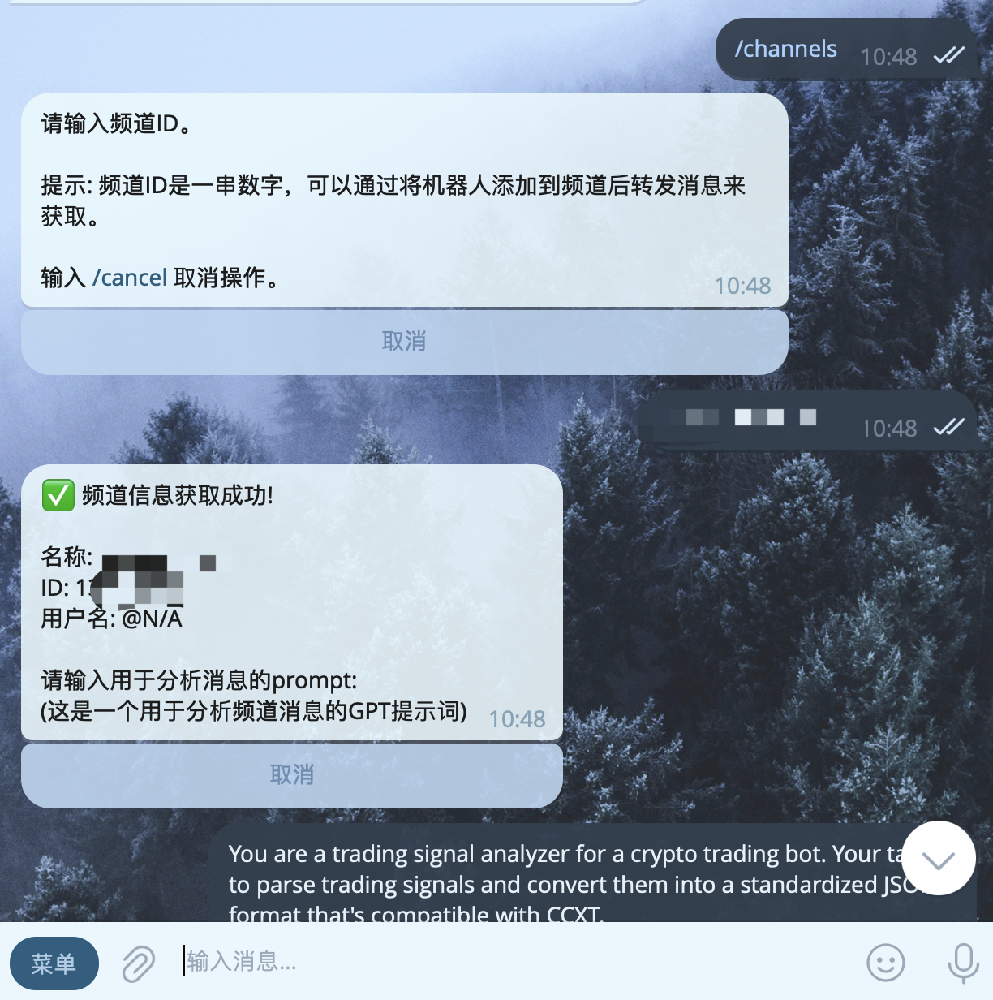
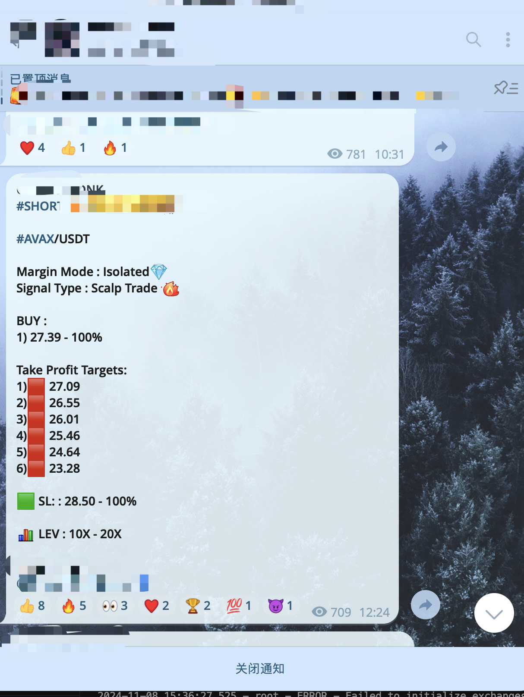
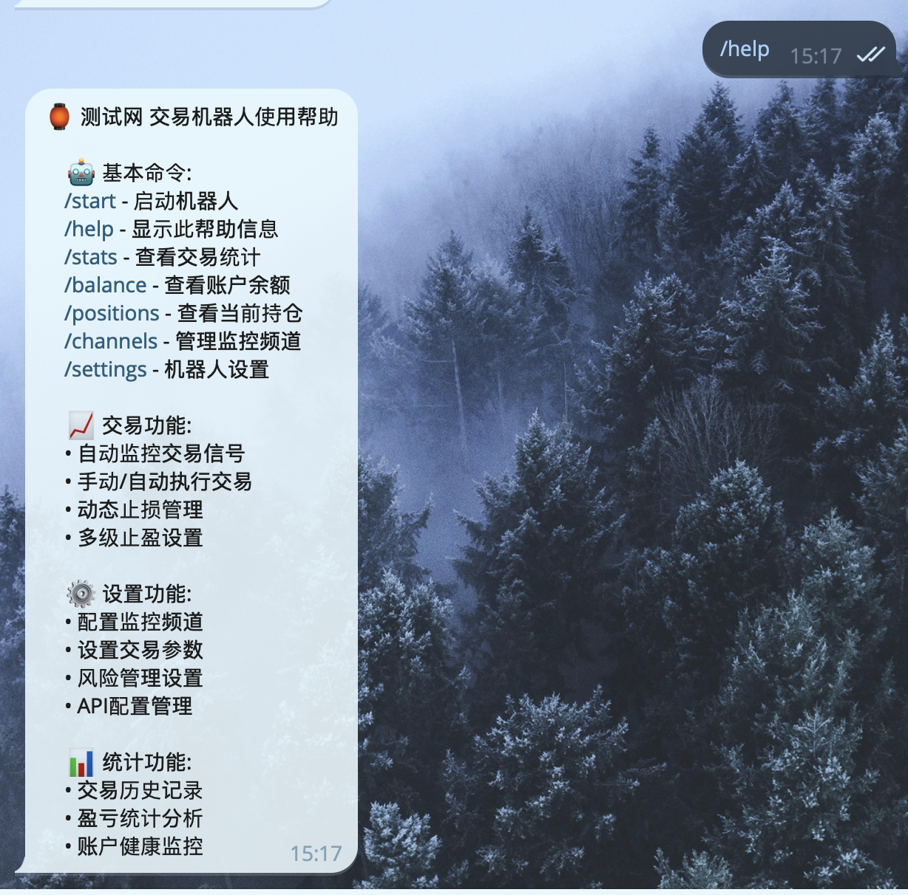

# 🤖 TelegramCopyTradeBot
> currently poor version Cornix alternative, only auto order works(Binance), OKX not tested

[English](README.md) | [中文](README_CN.md)

<div align="center">
  
</div>

[](https://opensource.org/licenses/MIT)
[](https://www.python.org/downloads/)
[](https://core.telegram.org/bots/api)
[](https://github.com/psf/black)
[](https://github.com/GentlemanHu/TelegramCopyTradeBot/issues)

[](https://github.com/GentlemanHu/TelegramCopyTradeBot/stargazers)
[](https://github.com/GentlemanHu/TelegramCopyTradeBot/network)
[](https://github.com/GentlemanHu/TelegramCopyTradeBot/issues)
[](https://github.com/GentlemanHu/TelegramCopyTradeBot/pulls)


An intelligent cryptocurrency copy trading bot based on Telegram, featuring multi-exchange support, GPT signal analysis, and automated trading execution.

## ✨ Key Features

- 🔄 Multi-Exchange Support (Binance, OKX)
- 📱 Telegram Bot Management Interface
- 🤖 GPT-Powered Signal Analysis
- 📊 Automated Trading Signal Monitoring
- 💰 Smart Trade Execution
- 📈 Dynamic Stop Loss & Multi-Level Take Profit
- ⚠️ Real-time Risk Monitoring
- 📊 Comprehensive Trading Analytics

## 🚀 Quick Start

### Prerequisites

```bash
Python 3.9+
pip
Git
```

### Installation

1. Clone Repository
```bash
git clone https://github.com/GentlemanHu/TelegramCopyTradeBot.git
cd TelegramCopyTradeBot
```

2. Install Dependencies
```bash
pip install -r requirements.txt
```

3. Configure Environment
Create `.env` file with the following:

```env
# Telegram Configuration
TELEGRAM_TOKEN=your_telegram_bot_token
API_ID=your_telegram_api_id
API_HASH=your_telegram_api_hash
OWNER_ID=your_telegram_user_id
PHONE_NUMBER=your_phone_number
SESSION_NAME=my_session

# OpenAI Configuration
OPENAI_API_KEY=your_openai_api_key
OPENAI_API_BASE_URL=your_openai_base_url

# Exchange API - Mainnet
BINANCE_API_KEY=your_binance_api_key
BINANCE_API_SECRET=your_binance_api_secret
OKX_API_KEY=your_okx_api_key
OKX_API_SECRET=your_okx_api_secret
OKX_PASSPHRASE=your_okx_passphrase

# Exchange API - Testnet
BINANCE_TESTNET_API_KEY=your_binance_testnet_key
BINANCE_TESTNET_API_SECRET=your_binance_testnet_secret
OKX_TESTNET_API_KEY=your_okx_testnet_key
OKX_TESTNET_API_SECRET=your_okx_testnet_secret
OKX_TESTNET_PASSPHRASE=your_okx_testnet_passphrase
```

### Launch Bot
```bash
python main.py
```

## 📱 Commands

- `/start` - Initialize bot
- `/help` - Show help
- `/stats` - View trading statistics
- `/balance` - Check account balance
- `/positions` - View current positions
- `/channels` - Manage monitoring channels
- `/settings` - Bot settings

## 🔧 Project Structure

```
TelegramCopyTradeBot/
├── main.py                # Main entry
├── config.py             # Configuration
├── database.py           # Database operations
├── models.py             # Data models
├── trading_logic.py      # Trading logic
├── exchange_execution.py # Exchange execution
├── message_processor.py  # Message processing
├── channel_management.py # Channel management
├── settings.py          # Settings management
└── button_texts.py      # UI texts
```

## 💡 Features

### GPT Signal Analysis
- [x] Intelligent trading signal recognition
- [ ] Risk assessment
- [ ] Automated trading suggestions

### Multi-Level Take Profit
- [x] Multiple TP targets
- [ ] Automatic position scaling
- [ ] Dynamic TP adjustment

### Risk Control
- [ ] Real-time position monitoring
- [ ] Automatic risk alerts
- [ ] Risk-based position closing


## Some usage guide

### Monitoring Channels
<div align="center">
  
</div>

### Signal Analysis
<div align="center">
  
</div>

### Help and Commands
<div align="center">
  
</div>


## 🤝 Contributing

1. Fork the repository
2. Create feature branch (`git checkout -b feature/AmazingFeature`)
3. Commit changes (`git commit -m 'Add AmazingFeature'`)
4. Push to branch (`git push origin feature/AmazingFeature`)
5. Open Pull Request

## 📜 License

This project is licensed under the MIT License - see [LICENSE](LICENSE) file

## 🎁 Support the Project

If you find this project helpful, please consider supporting its development:

<div align="center">
  <table>
    <tr>
      <th>Digital Asset</th>
      <th>Address</th>
    </tr>
    <tr>
      <td> BTC</td>
      <td><code>bc1p6qkthl9jqqgle7xh2savggcfz284953lw8xnyj4z67wswse0runscdyta5</code></td>
    </tr>
    <tr>
      <td> USDT (TRC20)</td>
      <td><code>TY1A9McJd6wz1ZgfVHmLEoQGFJX27WSNoN</code></td>
    </tr>
    <tr>
      <td> ETH</td>
      <td><code>0x5aa791a5fe03f823275d7240ebe887d35fdf0f3b</code></td>
    </tr>
  </table>
</div>

---

⭐ Star this repo if you find it helpful!


---

# ⚠️ Risk Warning and Disclaimer

---

## <a name="warning"></a>⚠️ RISK WARNING

```diff
- HIGH RISK INVESTMENT WARNING
```

Trading cryptocurrency involves substantial risk of loss and is not suitable for all investors. Please consider carefully whether such trading is suitable for you based on your financial condition and understanding of cryptocurrency markets.

### 🚨 Important Notice

1. **High Risk Investment**
   - Cryptocurrency trading is highly speculative
   - You may lose all your invested capital
   - Past performance is not indicative of future results

2. **Bot Trading Risks**
   - Automated trading systems may malfunction
   - Technical failures could lead to losses
   - Market conditions may change rapidly

3. **No Financial Advice**
   - This software is for information purposes only
   - Not financial or investment advice
   - Always conduct your own research

### 📜 Disclaimer

By using this software, you acknowledge and agree that:

1. The creators and contributors of this software:
   - Are not financial advisors
   - Make no guarantees about trading results
   - Accept no responsibility for your trading decisions
   
2. You are solely responsible for:
   - Your trading decisions
   - Your API keys security
   - Managing your risk
   - Any resulting profits or losses

3. This software:
   - May contain bugs or errors
   - Could cease functioning at any time
   - Provides no guarantee of profit

---

<div align="center">
<h3>⚠️ USE AT YOUR OWN RISK | 风险自负 ⚠️</h3>
<sup>The software is provided "as is", without warranty of any kind.</sup>
</div>
